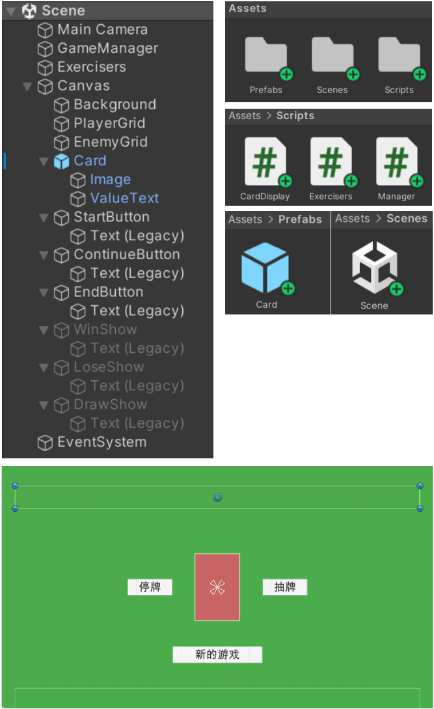
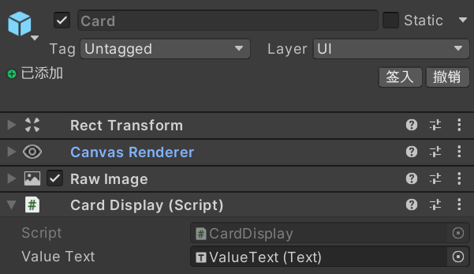
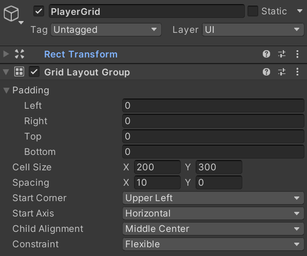
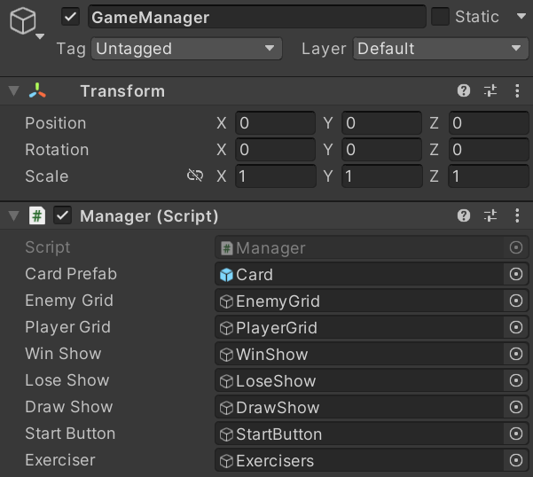
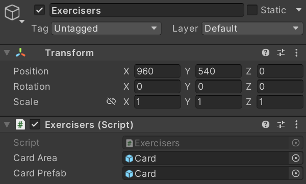

# 【Unity】《二十一点》- Lab2 博客 

Video URL：https://www.bilibili.com/video/BV1gP2SY7E5n/

---

## 一、游戏设计  

1. 玩家  

    该游戏为单人游戏；在游戏中，玩家需进行收益与风险的权衡，根据手中的牌的情况，在“抽牌”与“停牌”两种行为中选择更合适的行为，最终赢得与对手的点数博弈； 

2. 目标  

    玩家的目标是使手中的牌的点数之和不超过二十一点且尽量大，以超过对手的点数之和； 

3. 操作  

    玩家点击“新的游戏”按钮后开始新的一局游戏； 

    开始游戏后，玩家可以点击“抽牌”按钮进行抽牌；点击“停牌”按钮停止抽牌，等待对手操作完毕； 

4. 规则  

    游戏开始后，玩家与对手分别抽取两张牌； 

    若玩家或对手手牌内唯二的两张牌的点数之和为21点（黑杰克），则玩家或对手直接赢得该局，该局结束；

    若该局未结束，则玩家与对手轮流进行抽牌，对手先手，每次一张；一方停牌后另一方可连续抽牌； 

    若玩家或对手手牌内的所有牌的点数之和大于21点（爆牌），则玩家或对手该局直接判负，该局结束； 

    若双方都选择停牌，则展示双方手牌，点数之和大的一方获得该局的胜利； 

5. 结果  

    若对手爆牌或双方停牌后玩家手牌的点数之和大，则玩家获得该局的胜利； 

    若玩家爆牌或双方停牌后对手手牌的点数之和大，则玩家该局判负；

---

## 二、游戏对象  

  该游戏的项目结构，游戏对象与场景效果如下图所示： 
  
  

  1. Card对象为预制体，其子对象ValueText的文本内容默认为空；
  
  2. Card对象上挂载CardDisplay脚本，用于修改ValueText的文本内容； 
  
  

  3. PlayerGrid对象中存在Grid Layout Group组件，用于展示Player的所有手牌；EnemyGrid对象同理； 
  
  

  4. GameManager对象上挂载着Manager脚本，用于管理游戏的开始、进行与结束； 
  
  

  5. Exercisers对象上挂载着Exercisers脚本，用于为抽取的卡牌添加运动效果；其中，CardArea中的Card对象为放置于Scene中的Card对象，CardPrefab的Card对象为预制体Card对象； 
  
  

  6. WinShow，LoseShow与DrawShow对象为游戏胜负提示窗，初始不可见； 
  
  

---

## 三、游戏实现 

1. CardDisplay 

2. Exercisers 

    变量direction用于记录运动方向，变量time用于记录当前已运动的时间，变量running用于记录当前是否应该运动； 
  
    调用Init()函数，重置上述变量值，并创建运动对象； 
  
    Exercisers 类仅用于创建抽牌的动画效果，故newCard对象在运动完毕后销毁； 
  
    在本游戏中仅存在玩家抽牌，对手抽牌两种动画效果，故无需添加与传递运动时间，运动速度等参数； 

3. Manager 

    调用Shuffle()函数，洗牌，返回打乱后的牌堆列表； 

    调用DrawCard()函数，创建抽牌的动画效果，并调用DrawToEnemy()或DrawToPlayer()函数；该函数并不修改Model的参数值； 

    调用DrawToEnemy()与DrawToPlayer()函数，创建Card对象并将其在游戏中显示出来，同时修改Model的参数值； 

    在游戏运行时，玩家按下“新的游戏”，“抽牌”或“停牌”按钮后，分别调用OnClickStart()，OnClickContinue()或OnClickEnd()函数； 
